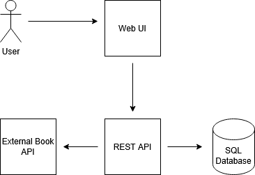
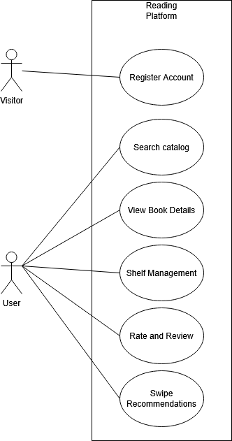

# reading-platform
Repo for final project in CIS4891.

## Overview
The proposed project is aimed at designing and developing a web based social reading application. The idea is to create a system that enables users to monitor the reading process, organize their own collections, and find new books in more free and personalized manner than the current platforms available. The project will consist of a database, API layer, and a graphical user interface, which is in line with the technical requirements of the course and will facilitate incremental development throughout the SDLC.

## Architecture

## Wireframes

## User Stories

### Account and Profiles
1. As a user, I want to create an account to be able to save and monitor my reading process.
2. As a user, I want to log in to the webpage in a secure manner so that no one can see my information.
3. As a user, I want to make my profile custom in such a way that my account is representative of my interests.

### Book Discovery
1. As a user, I want to search books to be able to find titles to add them to my shelves.
2. As a user, I want to see the book information to be able to choose the next book to read.
3. As a user, I want to have book ratings and reviews because I would be able to select books more confidently.

### Reading Tracking
1. As a user, I want to monitor manga in terms of volume to ensure my reading progress is correct.
2. As a user, I want to record my reading progress in order to keep my shelves up to date.
3. As a user, I want to indicate that I have read or dropped books to ensure that my reading history is systematized.

### Shelf Organization
1. As a user, I want to have custom shelves as a user because I would like to arrange my books in the manner I want.
2. As a user, I want personal shelves so that some of my reading lists would not be seen by anyone.
3. As a user, I want to be able to transfer books between shelves in order to have my organization evolve with time.

### Ratings
1. As a user, I want to rate my books to be able to remember how I liked them.
2. As a user, I want to be more specific in rating books in order that my ratings would be more representative of my opinions.
3. As a user, I want to leave reviews to enable me to express my opinion to other readers.

### Recommendations
1. As a user, I want to add books to my profile to get people to learn about books that I like.
2. As a user, I want to have a swipe based recommendations whereby finding new books is fast and enjoyable.
3. As a user, I want to receive recommendations depending on my reading history in order to get suggestions corresponding to my interests.

### Messaging and Social
1. As a user, I want to exchange books in messaging because this will enable me to be able to recommend books to friends with ease.
2. As a user, I want to post reviews to my friends in order to discuss books with them.
3. As a user, I want to send messages to friends in a way that we will be able to discuss reading without restriction.

## Use Cases

### Use Case 1: Register Account

**System:** Reading Platform  
**Primary actor:** Visitor  
**Goal:** Create a new user account  

**Preconditions**
- Visitor is not logged in.
- Registration page is available.

**Trigger**
- Visitor selects Register.

**Main success scenario**
1. System shows the registration form.
2. Visitor enters username, email, and password.
3. Visitor submits the form.
4. System validates required fields and password rules.
5. System checks that username and email are not already in use.
6. System creates the user account.
7. System signs the user in.
8. System shows the home screen.

**Alternate scenarios**
A1: Username or email already exists  
1. System shows an error message.  
2. Visitor changes the value and resubmits.  

A2: Password fails validation  
1. System shows password requirements.  
2. Visitor updates the password and resubmits.  

**Postconditions**
- A new user account exists.
- User is authenticated and can access user features.

---

### Use Case 2: Search Catalog

**System:** Reading Platform  
**Primary actor:** User  
**Goal:** Find a book or manga and view its details  

**Preconditions**
- User is logged in.
- Catalog search is available.

**Trigger**
- User enters a search query and submits.

**Main success scenario**
1. System receives the search request.
2. System returns matching titles.
3. User selects a title from the results.
4. System shows the title details page.
5. System displays metadata, ratings, and reviews.

**Alternate scenarios**
A1: No results found  
1. System displays a no results message.  
2. User adjusts search terms and searches again.  

A2: Title metadata not stored locally  
1. System retrieves metadata from an external books API.  
2. System stores metadata locally.  
3. System displays the title details page.  

**Postconditions**
- User views title information.
- Catalog metadata may be added or updated.

---

### Use Case 3: Add Title to Shelf and Track Progress

**System:** Reading Platform  
**Primary actor:** User  
**Goal:** Add a title to a shelf and record reading progress  

**Preconditions**
- User is logged in.
- Title details page is available.

**Trigger**
- User selects Add to Shelf.

**Main success scenario**
1. System displays shelf selection options.
2. User selects a shelf.
3. System adds the title to the selected shelf.
4. User selects reading status.
5. If the title is part of a series, system shows volume tracking controls.
6. User updates volume or progress information.
7. System saves shelf and progress data.
8. System confirms the update.

**Alternate scenarios**
A1: User creates a new shelf  
1. User selects Create new shelf.  
2. System requests shelf name and privacy setting.  
3. System creates the shelf.  
4. User adds the title to the new shelf.  

A2: User removes the title from shelf  
1. User selects Remove from shelf.  
2. System removes the title and clears progress data.  

**Postconditions**
- Title exists in a user shelf.
- Progress data is stored.

---

### Use Case 4: Rate and Review a Title

**System:** Reading Platform  
**Primary actor:** User  
**Goal:** Submit a rating and optional review  

**Preconditions**
- User is logged in.
- Title details page is available.

**Trigger**
- User selects rating or review option.

**Main success scenario**
1. User selects a rating using half star increments.
2. System stores the rating.
3. User optionally writes a review.
4. User submits the review.
5. System validates the content.
6. System saves the review.
7. System updates displayed ratings and reviews.

**Alternate scenarios**
A1: User edits or deletes review  
1. User opens existing review.  
2. System allows modification or deletion.  
3. System updates stored data.  

A2: Validation fails  
1. System displays an error message.  
2. User corrects the input and resubmits.  

**Postconditions**
- Rating is stored for the user.
- Review is stored if submitted.

---

### Use Case 5: Browse Swipe Recommendations

**System:** Reading Platform  
**Primary actor:** User  
**Goal:** Provide feedback on recommendations and save titles  

**Preconditions**
- User is logged in.
- Recommendations feature is available.

**Trigger**
- User opens recommendations screen.

**Main success scenario**
1. System displays a recommendation card.
2. User swipes right to like or left to skip.
3. System records feedback.
4. System loads the next recommendation.
5. System offers option to add liked title to shelf.
6. User adds title to shelf.
7. System saves shelf data.

**Alternate scenarios**
A1: User opens title details  
1. User selects View details.  
2. System navigates to title details page.  
3. User returns to recommendations.  

A2: No recommendations available  
1. System displays a message indicating no recommendations.  
2. System suggests searching or rating titles.  

**Postconditions**
- Recommendation feedback is stored.
- Liked titles may be saved to shelves.

## Use Case Diagram
